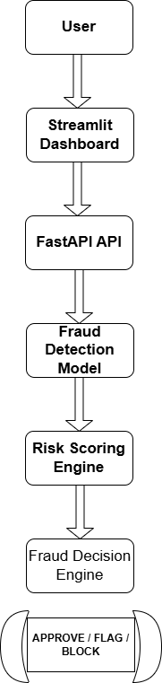
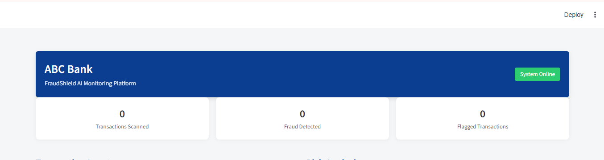
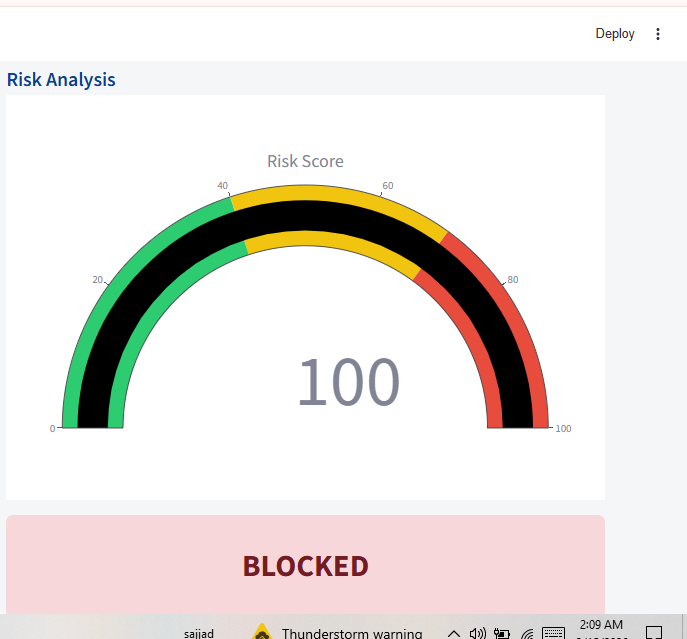
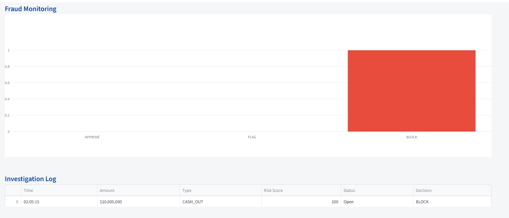

# FraudShield AI

AI-powered fraud detection system for financial transactions using Machine Learning, FastAPI, and Streamlit.

Developed by **Sajjad Dahani**

---

## Project Overview

FraudShield AI is a fraud detection platform designed for banks and fintech systems.  
It analyzes transaction data and predicts the probability of fraud using machine learning models.

The system includes:

• Fraud detection model  
• Risk scoring engine  
• FastAPI backend  
• Streamlit monitoring dashboard  
• Fraud monitoring analytics  

---

## Problem

Financial institutions face increasing fraud such as:

• Unauthorized transactions  
• Account takeover attacks  
• Fraudulent transfers  
• Digital wallet fraud  

Detecting fraud is difficult because fraud cases are extremely rare compared to legitimate transactions.

---

## Solution

FraudShield AI uses machine learning models to analyze transaction patterns and generate:

• Fraud probability  
• Risk score  
• Decision (APPROVE / FLAG / BLOCK)

---

## System Architecture

User → Streamlit Dashboard → FastAPI API → ML Fraud Model → Risk Engine → Decision Output


---

## Technologies Used

Python  
Scikit-learn  
FastAPI  
Streamlit  
Pandas  
Plotly  
NumPy  

---

## Features

• AI fraud detection  
• Risk scoring system  
• Real-time API prediction  
• Fraud monitoring dashboard  
• Suspicious transaction logging  

---

## How to Run

Install dependencies

```
pip install -r requirements.txt
```

Run the API

```
uvicorn api.fraud_api:app --reload
```

Run the dashboard

```
streamlit run dashboard/app.py

---
## Dashboard Preview

### System Overview


### Risk Analysis


### Fraud Monitoring

```

---

## Developer

Sajjad Dahani
